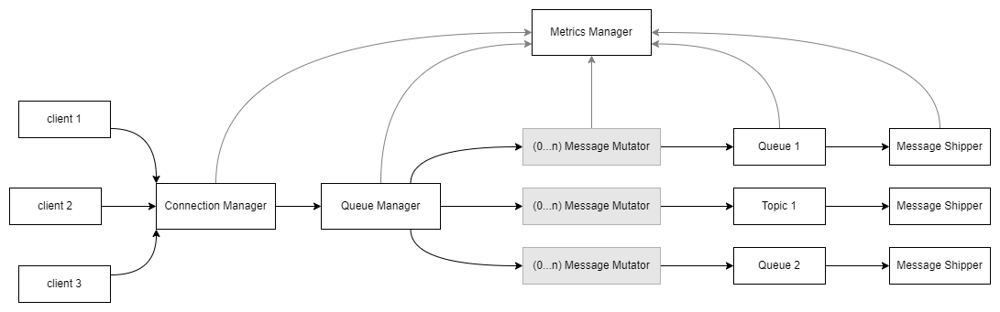

# Agora

This project centres around building an enterprise-style messaging broker, in
designing network-oriented distributed applications using a GoLang, whilst following software design, test and architecture best practises - such as
unit-testing, Continuous Integration (CI), and built-in monitoring.
In broad strokes, my project has the following goals:

• Learn and evaluate the impact and usefulness of GoLang’s fairly unique set of
  concurrency primitives in constructing and testing high performance software.

• Design and build a well-tested, stable message broker in GoLang.

• Evaluate the performance and feature-set of my implementation.


# Project Design

## Command-line Configuration

A number of these configurable parameters make sense to expose as command-line parameters, specified at application start time. The available parameters can be exposed using the ``--help`` parameter.

```bash
$ ./gamq --help
Usage of ./gamq:
  -port int
      The port to listen on (default 48879)
  -profile
      Produce a pprof file
  -statsd string
      The StatsD endpoint to send metrics to
```
## File-based Configuration

Whilst specifying arguments on the command line gives flexibility, there are certain options that, whilst configurable, are either too numerous, or change too infrequently to justify command-line flags. One major example of this is the log configuration for the broker - an XML file specifying specifying the format, and location of messages logged using the Seelog library.

The defines the format and location of log messages written by Agora:

```bash
<seelog minlevel="debug" type="asynctimer" asyncinterval="1000">
  <outputs formatid="common">
    <console/>
  </outputs>
  <formats>
    <format id="common"
      format="%Date(02-01-2006 15:04:05.000-0700) [%LEVEL] %Msg%n"/>
  </formats>
</seelog>
```

## Code Structure



The communications between each system block (shown in black) are handled via GoChannels. The responsibilities of each block are as follows:

1. **Connection Manager**

    Handle incoming and open connections for each of the broker protocols, and maintain
    details of connected clients. The protocol used for client connections is abstracted
    inside ConnectionManager, so that a client can transparently use TCP, UDP -
    or some other protocol. Connection Manager parses received commands, and calls
    the relevant methods on QueueManager.
    
    The acceptance of incoming connections requires the specifics of each protocol
    to be abstracted away using a standard interface through which
    messages can be sent to clients, the ’writer’ interface in this case. An example of the UDP
    writer interface is implemented. 
    
    Once connected, each client is serviced by
    a separate GoRoutine in an Event Loop-style pattern - the main Connection Manager
    thread performs the minimal amount of work necessary before farming a client out to a
    background GoRoutine, in order to prevent one connecting client from blocking another.
    
    The parsing of each client message is simply a matter of tokenisation and pattern
    matching. The biggest performance gains to be exploited in a
    message broker are in ensuring efficient serialisation and serialisation of messages - so this
    was a focus of the protocol parsing logic.


2. **Queue Manager**

    Maintains a list of active queues/topics, and handles the publishing of messages to
    said queues/topics, as well as the addition/removal of subscribers

3. **Message Mutators**

    An optional module for each queue/topic, which allows simple mutations to be
    performed on messages as they pass through the broker. One example could be
    throwing away values below/above a certain threshold, or enriching data as it passes
    through the data, with information from an external database. Multiple message
    mutators can be chained together, should multiple mutations be required.
    
4. **Queue/Topics**

    The buffering datastructures designed to hold and deliver messages to consumers.
    Due to the semantic differences between queues and topics, subtly different datastructures are required for each

5. **Message Shippers**

    The Message Shipper is responsible for pulling messages off an internal agora queue/topic
    and sending them to consumers. Thanks to the blocking characteristic
    of GoChannels, this is as simple as listening to the GoChannel attached
    to the subscribers queue/topic, encoding messages as they are pulled off the queue and
    sending the bytes to the ’writer’ object created by the Connection Manager.
    
6. **Metric Manager**

    Responsible for collecting metrics about broker performance from each of the
    broker components (latency, throughout, number of connected clients etc.), and
    asynchronously ship them for visualisation and analysis.
  

